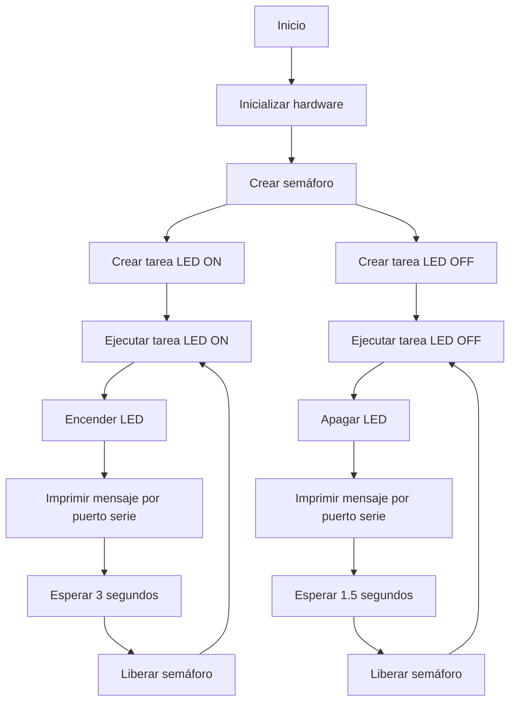

# PRACTICA 4 :  SISTEMAS OPERATIVOS EN TIEMPO REAL  
Alumna: Àfrica Abad

El objetivo de la practica es comprender el funcionamiento de un sistema operativo en tiempo 
Real .

Para lo cual realizaremos una practica  donde  generaremos varias tareas  y veremos como 
se ejecutan dividiendo el tiempo de uso de la cpu.

## EJERCICIO PRÁCTICO 2: Semaforo

Realizar un programa que utilice dos tareas  una enciende un led y otra  lo apaga dichas tareas deben estar sincronizadas 

  
**1. Salida por el puerto serie**

Por el puerto serie se muestra qué tarea está corriendo en cada momento.
En caso que esté corriendo la tarea 'led ON' por el puerto serie se mostrará: 
        

    Ejecutando tarea: LED ON

Si en cambio está corriendo la tarea 'led OFF', aparecerá por el puerto serie:

    Ejecutando tarea: LED OFF

Estos mensjaes se imprimirán en el monitor serial cada vez que se ejecuta la respectiva tarea.

**2. Funcionamiento**

En la función 'void setup()'se inicia la comunicación a una velocidad de 112500 baudios, se configura el pin LED como salida y se crea el semáforo utilizando 'xSemaphoreCreateMutex()'. 

    
        xTaskCreate(ledON, "LED ON", 10000, NULL, 1, NULL);
        xTaskCreate(ledOFF, "LED OFF", 10000, NULL, 1, NULL);

Aquí estamos creando dos tareas, una para encender el LED y otra para apagarlo (ambas tareas con prioridad 1).

El bucle pricipal 'void loop()' está vacio, ya que todo el trabajo se realiza en las tareas creadas.

**Tarea para encender el LED: 'ledON()'**

    void ledON (void * pvParameters){
        for(;;){
            xSemaphoreTake(semafor, portMAX_DELAY);
            digitalWrite(LED, HIGH);
            Serial.println("Ejecutando tarea: LED ON");
            delay(3000);
            xSemaphoreGive(semafor);
        }
    }

Para encender el LED uso un bucle infinito 'for(;;)' que se ejecuta constantemente hasta que el programa se detiene. Dentro de este bucle el programa se asegura que nadie más está utilizando el LED en ese momento (mediante el uso del semáforo) y una vez asegurado, enciende el LED e imprime un mensaje por el puerto serie para informar que está encendiendo. Después de esperar 3 segundos (tiempo que he puesto en el delay pero es modificable), libera el semáforo para permitir que otras partes del programa accedan al LED si es necesario. 

**Tarea para apagar el LED: 'ledOFF()'**

    void ledOFF (void * pvParameters){
        for(;;){
            xSemaphoreTake(semafor, portMAX_DELAY);
            digitalWrite(LED, LOW);
            Serial.println("Ejecutando tarea: LED OFF");
            delay(1500);
            xSemaphoreGive(semafor);
        }
    }

 Para apagar el LED, utilizo un bucle infinito (for(;;)) que se ejecuta constantemente mientras el programa está en ejecución. Para apagar el LED, utilizo un bucle infinito (for(;;)) que se ejecuta constantemente mientras el programa está en ejecución. Dentro de este bucle, el programa se asegura de que nadie más esté utilizando el LED simultáneamente. Una vez asegurado, apaga el LED y luego imprime un mensaje por el puerto serie para informar que está apagado. Después de esperar 1.5 segundos (el tiempo definido en el 'delay()' pero que puede ser modificado), libera el semáforo para permitir que otras partes del programa accedan al LED si es necesario.

**3. Diagrama de flujo**

**Conclusión**

En esta práctica he aprendido cómo controlar un LED utilizando un microcontrolador (ESP32) con múltiples tareas mediante semáforos. He aprendido a hacer que el ESP32 realice varias cosas al mismo tiempo, como encender y apagar el LED, sin que una tarea interfiera con la otra. También he aprendido cómo evitar que dos tareas intenten usar el LED al mismo tiempo, lo que podría causar problemas.

He utilizado la comunicación serial para imprimir mensajes, ya que personalmente me han ayudado a entender qué estaba haciendo el programa en cada momento y a solucionar problemas más fácilmente.
